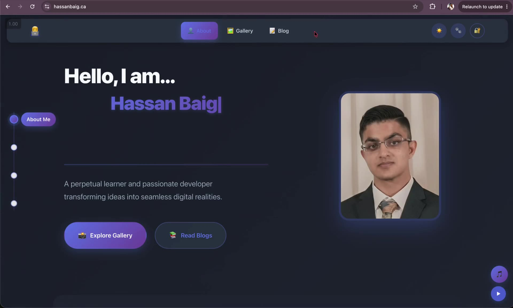

# Binterest

Hassan Baig's React and TypeScript portfolio, built with Vite and deployed to Azure Static Web Apps.
Live at <https://hassanbaig.ca>.

## Demo

▶️ **[Watch the demo](docs/portfolio-demo.mp4)** (1:43): the About page, photo gallery and
blog, then signing in as admin to upload a captioned photo, write and delete a blog post,
and remove the photo again.

## Local development

1. Install the Node version in `.nvmrc` with `nvm install` and activate it with `nvm use`.
2. Run `npm install`.
3. Copy `.env.example` to `.env.local` and provide the Entra application values.
4. Run `npm run dev` and open <http://localhost:3000>.

During local development, `/api` is proxied to the deployed API by Vite so the
browser does not require a localhost CORS exception.

## Commands

- `npm run dev` starts the Vite development server.
- `npm run typecheck` checks TypeScript without emitting files.
- `npm test` runs the Vitest suite once.
- `npm run test:watch` runs Vitest in watch mode.
- `npm run build` type-checks and creates a production build in `dist/`.
- `npm run preview` serves the production build locally.

Environment variables included in frontend builds are public. Never put secrets in a `VITE_*` variable.
